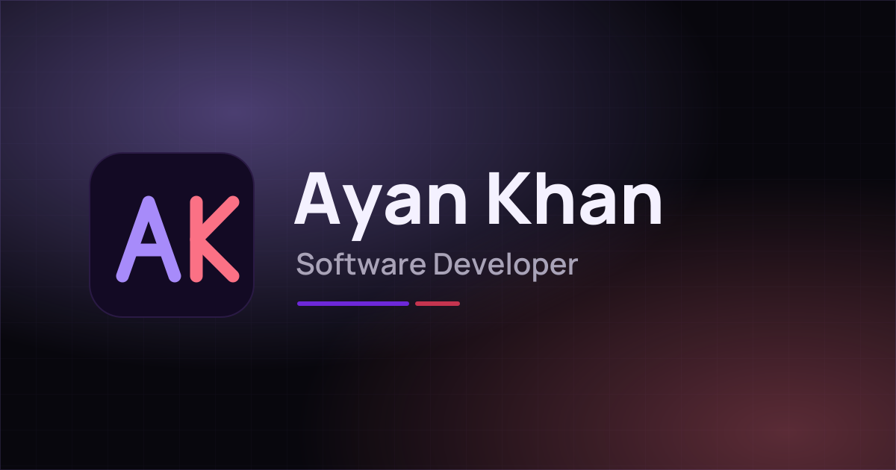

<div align="center">



<br />

[](https://github.com/ThunderKhan/ThunderKhan.github.io/actions/workflows/ci.yml)


A fast, editorial-style portfolio for projects, open-source work, technical writing, and the engineering behind them.

**[ayankhan.me](https://ayankhan.me/) · [Writing](https://ayankhan.me/blog) · [Résumé](https://ayankhan.me/Ayan_Khan_Resume.pdf)**

[Architecture](#architecture) · [Development](#development) · [Content model](#content-model) · [Blog publishing](#blog-publishing) · [CI--deployment](#ci--deployment)

</div>

---

## Why this portfolio?

This repository powers my personal developer portfolio and writing site.

Rather than treating the site as a static résumé, it is built as a small engineering project of its own: structured content, route-specific metadata, static blog routes, build-time GitHub activity, accessibility checks, and automated deployment all live in one maintainable codebase.

The site brings together:

- selected software projects and technical work;
- open-source contributions and GitHub activity;
- systems, developer tooling, ML, and research interests;
- education, skills, and résumé;
- long-form engineering articles published under `/blog`.

---

## Architecture

The portfolio is a static React application built with Vite and deployed to GitHub Pages.

```text
structured content
    ↓
React components
    ↓
Vite production build
    ↓
blog route prerendering
    ↓
static dist/ artifact
    ↓
GitHub Pages
    ↓
ayankhan.me
```

| Layer | Technology / responsibility |
|---|---|
| UI | React 19 + TypeScript |
| Styling | Tailwind CSS 4 |
| Motion | Motion with reduced-motion support |
| Icons | Lucide React |
| Typography | self-hosted Manrope + IBM Plex Mono |
| Portfolio content | `src/data/portfolio.ts` |
| Blog content | `src/data/blogs.ts` |
| Blog route generation | `scripts/prerender-blog.mjs` |
| GitHub activity | `scripts/fetch-github-contributions.mjs` |
| Quality gates | ESLint, React Hooks, JSX accessibility rules |
| Delivery | GitHub Actions + GitHub Pages |

### Static blog routes

GitHub Pages does not provide server-side routing, so blog URLs are materialized during the production build.

For each post, the build produces route-specific HTML containing the article's title, description, canonical URL, Open Graph metadata, Twitter metadata, and publication date before the React application runs.

```text
/blog
/blog/<slug>
```

This keeps clean public URLs while preserving a fully static deployment model.

---

## Development

Requirements:

```text
Node.js 22+
npm
```

Install the exact dependency graph:

```bash
npm ci
```

Start the local development server:

```bash
npm run dev
```

Run the repository quality gates:

```bash
npm run lint
npm run build
```

Preview the production artifact:

```bash
npm run preview
```

The final static site is emitted to:

```text
dist/
```

---

## Content model

The site deliberately keeps most portfolio information outside the component tree.

### Portfolio

Primary portfolio content lives in:

```text
src/data/portfolio.ts
```

It contains structured data for the site's identity, professional links, résumé, about section, education, projects, skills, interests, and related portfolio content.

Components consume that data instead of embedding large amounts of profile copy directly into JSX.

### Static assets

Public assets live under:

```text
public/
```

This includes the résumé, favicons, Open Graph image, sitemap, robots file, 404 page, and project imagery.

---

## Blog publishing

Articles live in:

```text
src/data/blogs.ts
```

Each post defines:

| Field | Purpose |
|---|---|
| `slug` | public `/blog/<slug>` route |
| `title` / `description` | article and sharing metadata |
| `date` / `readingTime` | publication information |
| `tags` | article topics |
| `cover` | article/share image |
| `canonicalUrl` | canonical SEO URL |
| `crossPosts` | external publication copies |
| `repositoryUrl` | related source repository |
| `content` | structured article blocks |

During `npm run build`, `scripts/prerender-blog.mjs` reads the blog metadata and writes static HTML entries for `/blog` and every article route.

Until sitemap generation is automated, new articles must also be added to:

```text
public/sitemap.xml
```

---

## SEO and accessibility

The repository includes the infrastructure expected from a production personal site rather than relying on the SPA shell alone.

### SEO

- canonical URLs on the `ayankhan.me` domain;
- Open Graph and Twitter Card metadata;
- `Person` JSON-LD on the main document;
- route-specific blog metadata generated at build time;
- `robots.txt` and `sitemap.xml`;
- custom GitHub Pages 404 handling.

### Accessibility

- skip-to-content navigation;
- keyboard-accessible interactive controls;
- reduced-motion behavior through Motion's user preference handling;
- JSX accessibility rules enforced by ESLint in CI.

---

## CI & deployment

Pull requests targeting `main` run the public CI workflow:

```text
npm ci
   ↓
npm run lint
   ↓
Generate GitHub contribution data
   ↓
npm run build
```

The build includes TypeScript compilation, the Vite production build, and static blog route generation.

Pushes to `main` run the GitHub Pages deployment workflow. The same production artifact is uploaded and deployed to:

**https://ayankhan.me/**

The deployment workflow also runs daily so the public GitHub contribution data shown on the portfolio can stay current without a source-code change.

---

## Project structure

```text
.github/workflows/
├── ci.yml                          pull-request quality gates
└── deploy.yml                      production GitHub Pages deployment

public/
├── Ayan_Khan_Resume.pdf            public résumé
├── 404.html                        GitHub Pages route fallback
├── favicon.svg
├── og-image.png                    default social preview
├── robots.txt
└── sitemap.xml

scripts/
├── fetch-github-contributions.mjs  build-time GitHub activity
├── generate-apple-icon.mjs         icon generation utility
├── generate-og.mjs                 social-image generation utility
└── prerender-blog.mjs              static blog route generator

src/
├── components/                     portfolio + blog UI
├── data/
│   ├── portfolio.ts                portfolio content model
│   └── blogs.ts                    articles + blog metadata
├── hooks/                          UI state and behavior hooks
├── App.tsx                         route selection + composition
├── index.css                       theme and Tailwind styles
└── main.tsx                        React application entry point

eslint.config.mjs                   lint/accessibility configuration
index.html                          base SEO + JSON-LD + theme bootstrap
package.json                        scripts and dependencies
vite.config.ts                      Vite configuration
```

---

## Repository policy

This repository is public so the implementation can be inspected, but it also contains my personal portfolio copy, résumé, writing, imagery, and branding.

Unless a file explicitly states otherwise, those personal assets are not provided for reuse or redistribution as another person's portfolio.
